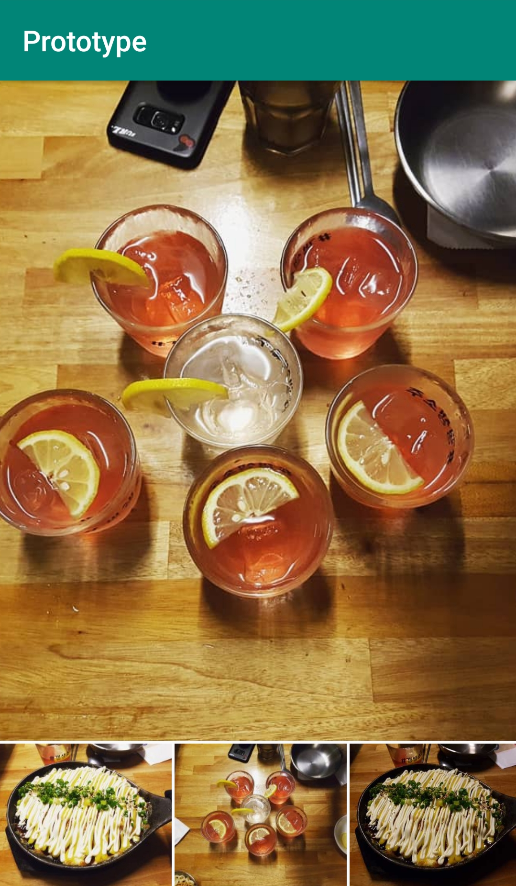
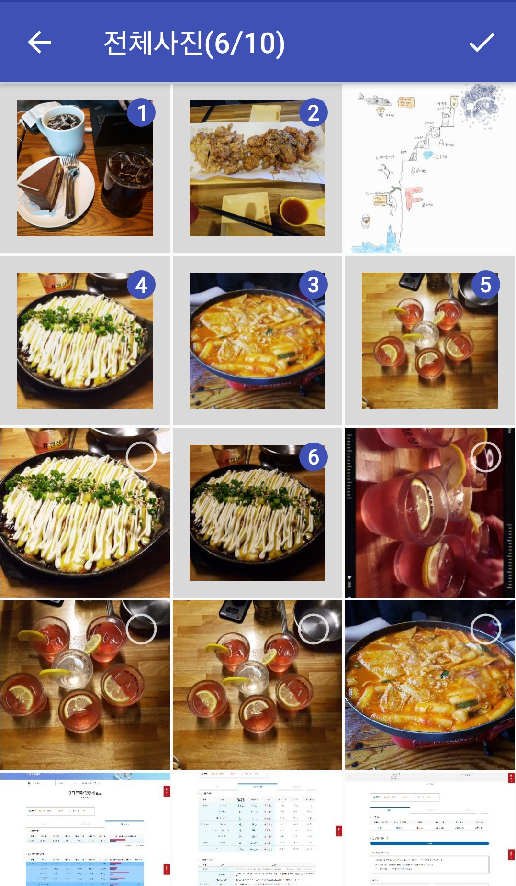
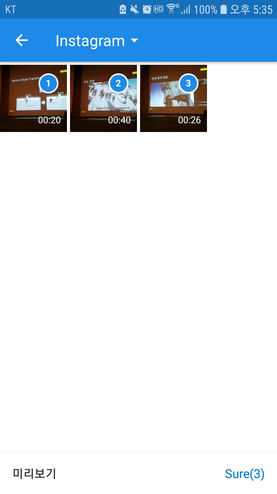
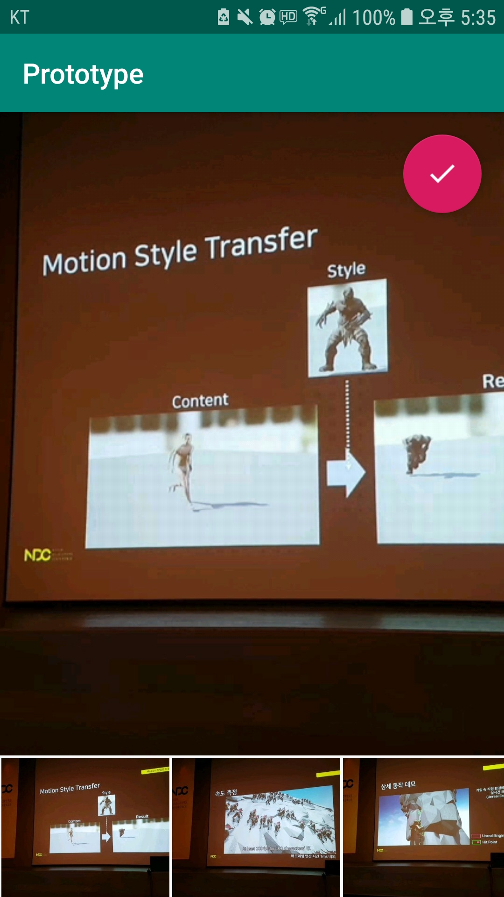
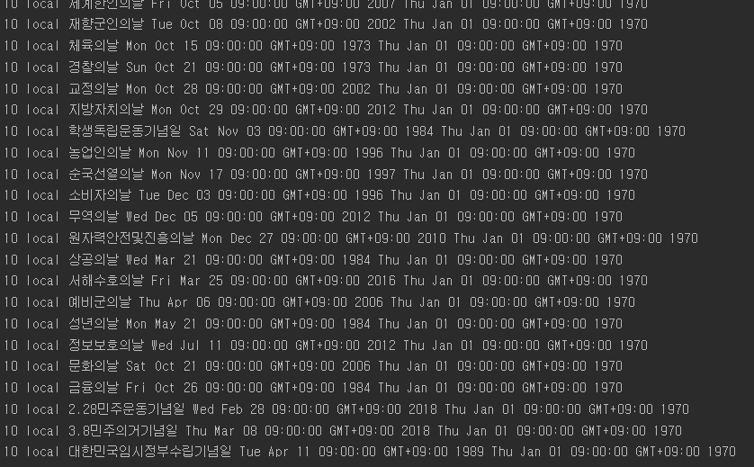

# Prototype for our app(Event Planner)

### Picking Images
>
>

### Picking Videos
>
>

### Using Calendar APIs
>

## Need to Implement (Task List)
- [x] Support an easy-to-share button to share media files such as photos and videos as convinient as possible.
    > Adopt the custom multiple image selection library.
- [x] Sync with the default Android calendar app
    > Request to Google Calendar and get the data
- [ ] Pinpoint a marker on a map either by the current location or by a random choice of an user.
    > Use Kakao Map APIs or Kakao Navigation APIs.

## Details in Code

### Pick multiple files - use the image picking library([FishBun](https://github.com/sangcomz/FishBun))
> ~~Using Android default image selection app is deprecated~~

### Share Multiple Files
```java
// Input: Array List of Uris
protected void shareFile(final ArrayList<Uri> dataURI){
    ...

    if(dataURI.size() == 1){
        // Single File
        sendIntent = new Intent(Intent.ACTION_SEND);
        sendIntent.putExtra(Intent.EXTRA_STREAM, dataURI.get(0));
    }else{
        // Multiple Files
        sendIntent = new Intent(Intent.ACTION_SEND_MULTIPLE);
        sendIntent.putExtra(Intent.EXTRA_STREAM, dataURI);
    }

    ...

    // Create intent to show the chooser dialog
    Intent chooser = Intent.createChooser(sendIntent, title);

    // Verify the original intent will resolve to at least one activity
    if (sendIntent.resolveActivity(getPackageManager()) != null) {
        startActivity(chooser);
    }
}
```

## 3rd party libraries that are being used.

1. [Glide](https://github.com/bumptech/glide)
> Glide is an image loading and caching library for Android focused on smooth scrolling.